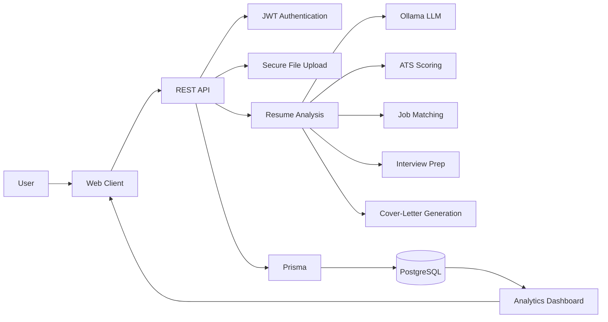
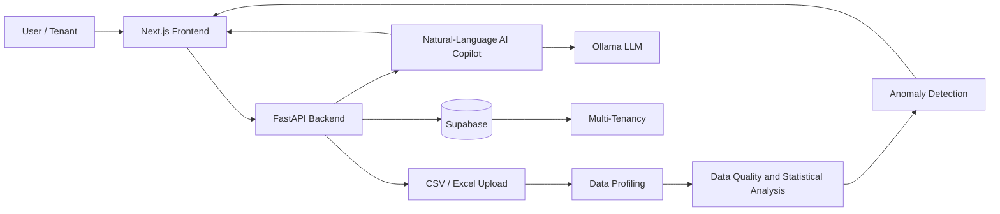

<!-- ===================== HERO ===================== -->
<div align="center">


<!--
  OPTIONAL: custom 3D / isometric hero visual.
  1. Add your image to assets/hero.png (recommended ~1600x500)
  2. Delete the comment markers around this block.

<picture>
  <source media="(prefers-color-scheme: dark)" srcset="assets/hero-dark.png">
  
</picture>
-->

<a href="https://github.com/[abhi-7755]">
  
</a>

<br/>


</div>

---

## ⚡ About Me

I'm **Abhishek Gaikwad**, a developer from **Pune, Maharashtra, India**, focused on **full-stack applications, modern web architecture, and AI/ML backends**. I'm studying Computer Science / Software Engineering at **Dr. D. Y. Patil Institute of Technology, Pimpri, Pune**.

```js
const abhishek = {
  location: "Pune, Maharashtra, India",
  education: "Dr. D. Y. Patil Institute of Technology, Pimpri, Pune",
  focus: ["Full-stack applications", "Modern web architecture", "AI/ML backends"],
  currentlyLearning: ["Advanced AI/ML", "LLM integrations", "Intelligent systems"],
};
```

---

## 🧰 Tech Stack

<div align="center">

**Languages**<br/>


**Frontend**<br/>


**Backend & Databases**<br/>


**AI & Tools**<br/>


</div>

---

## 🚀 Featured Projects

<table>
<tr>
<td width="50%" valign="top">

### 📄 ResumeIQ
**AI Resume Analyzer**

Ollama-powered resume analysis with job matching and career-prep tools.

<ul>
  <li>Ollama-powered resume analysis</li>
  <li>ATS scoring and job matching</li>
  <li>Interview preparation</li>
  <li>Cover-letter generation</li>
  <li>JWT authentication</li>
  <li>Secure uploads + REST APIs</li>
  <li>PostgreSQL + Prisma</li>
  <li>Analytics dashboard</li>
</ul>


[]([RESUMEIQ_REPO_LINK])
[]([RESUMEIQ_LIVE_DEMO_LINK])

</td>
<td width="50%" valign="top">

### 📊 Quantara
**AI Business Analytics**

Upload business data, profile it, find anomalies, and ask questions in natural language.

<ul>
  <li>CSV/Excel upload and profiling</li>
  <li>Data quality / statistical analysis</li>
  <li>Anomaly detection</li>
  <li>Natural-language AI Copilot</li>
  <li>Multi-tenancy</li>
  <li>Next.js + FastAPI + Ollama + Supabase</li>
</ul>


[]([QUANTARA_REPO_LINK])
[]([QUANTARA_LIVE_DEMO_LINK])

</td>
</tr>
</table>

---

## 🏗️ System Architecture

### ResumeIQ



### Quantara



---

## 🧠 AI / Engineering Focus

<table>
<tr>
<td width="50%" valign="top">

**🤖 Local LLM Integration**<br/>
Using Ollama to power resume analysis in ResumeIQ and the natural-language Copilot in Quantara.

</td>
<td width="50%" valign="top">

**🔐 Secure Backends**<br/>
JWT authentication, secure uploads, and REST APIs backed by PostgreSQL + Prisma.

</td>
</tr>
<tr>
<td width="50%" valign="top">

**📈 Data-Driven Features**<br/>
Data profiling, statistical analysis, and anomaly detection on uploaded CSV/Excel data.

</td>
<td width="50%" valign="top">

**🏢 Modern Web Architecture**<br/>
Next.js + FastAPI + Supabase, including multi-tenant design.

</td>
</tr>
</table>

---

## 🔭 Currently Exploring

- 🧬 Advanced AI/ML
- 🔗 LLM integrations
- 🧠 Intelligent systems

---

## 📊 GitHub Analytics

<div align="center">


<br/>


<br/>


</div>

---

## 🧭 Developer Philosophy

> *Build things that work, then make them clean, secure, and scalable.*

- **Ship real systems:** end-to-end, from database to UI.
- **Security is a feature:** authentication and safe uploads from day one.
- **AI as a tool, not decoration:** integrate models where they solve a real problem.
- **Keep learning:** the stack evolves, and so should the developer.

---

## 📬 Let's Connect

<div align="center">

[]((https://www.linkedin.com/in/abhishek-gaikwad-65b616333/?isSelfProfile=true))
[](mailto:abhishekgaikwad1808@gmail.com)
[]([YOUR_PORTFOLIO_URL])
[](https://github.com/abhi-7755)

</div>

<!-- ===================== FOOTER ===================== -->
<div align="center">


<sub>Designed and built by Abhishek Gaikwad · Pune, India</sub>

</div>
